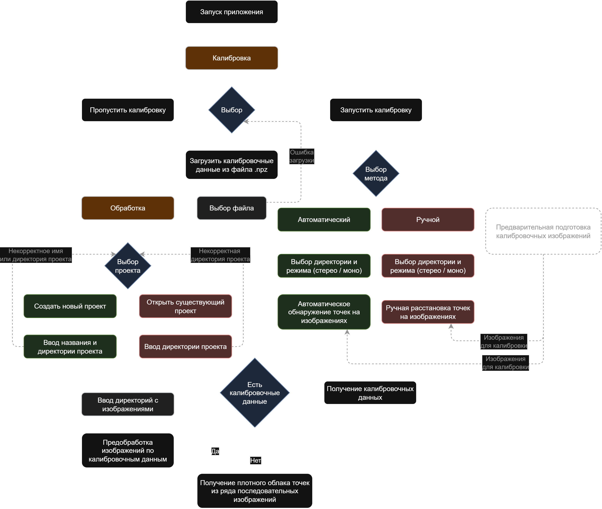
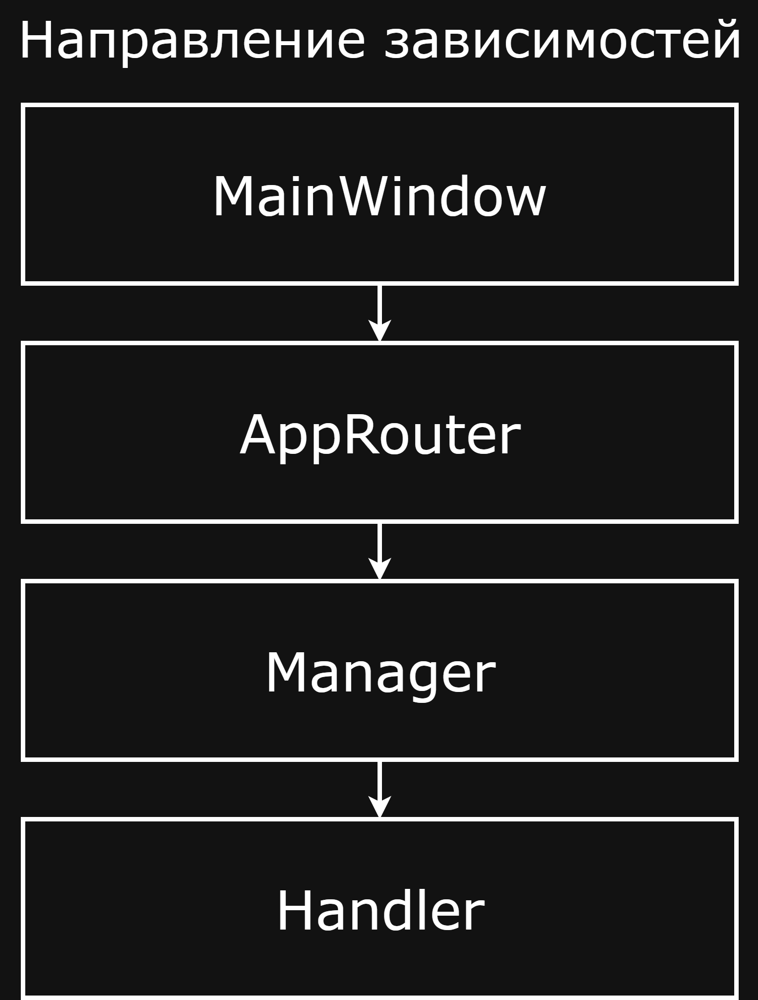
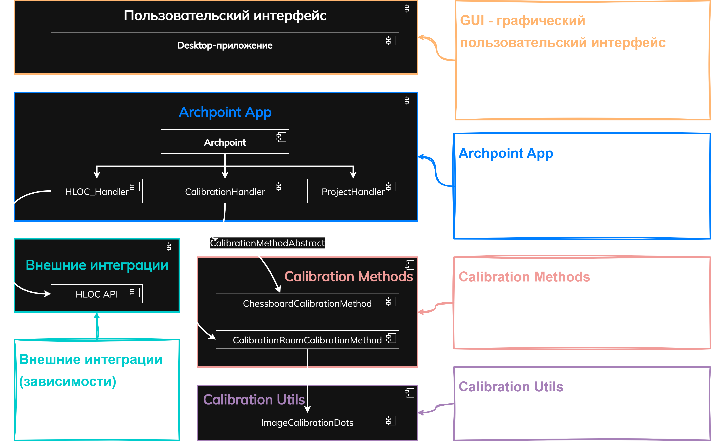

<p align="center">
  
</p>

<h1 align="center">Archpoint</h1>

<p align="center">
  Desktop-приложение для получения плотного облака точек архитектурных объектов по набору изображений с поддержкой автоматической и ручной калибровки камер в моно и стерео режимах.
</p>

<p align="center">
  
  
  
</p>

<p align="center">
  <a href="https://github.com/cloudsucker/archpoint/commits/main/">
    
  </a>
  <a href="https://github.com/cloudsucker/archpoint/issues">
    
  </a>
  <a href="LICENSE">
    
  </a>
  </br>
    <a href="https://github.com/users/cloudsucker/projects/3">
    
  </a>
</p>

<p align="center">
  
</p>

> [!WARNING]
> Данный репозиторий был заморожен на стадии разработки.
> Некоторый функционал может не работать или быть реализован неполностью. Буду рад помощи в продолжении разработки!

## **🧭 Содержание**

- [🗺️ Путь пользователя](#-путь-пользователя)
- [📦 Установка](#-установка)
- [🚀 Запуск](#-запуск)
- [🧱 Архитектура проекта](#-архитектура-проекта)
- [📬 Обратная связь](#-обратная-связь)

## **📦 Путь пользователя**

Для быстрого понимания встроенного функционала был создана диаграмма пользовательского пути:



## **📦 Установка**

#### 1. **Клонируйте репозиторий:**

```bash
git clone https://github.com/cloudsucker/archpoint.git
cd archpoint
```

#### **2. Создайте виртуальное окружение:**

```bash
python -m venv .venv
```

#### **3. Активируйте виртуальное окружение:**

-   **Windows**:

    ```bash
    .venv\Scripts\activate
    ```

-   **Linux/MacOS**:

    ```bash
    source .venv/bin/activate
    ```

#### 4. **Установите зависимости:**

```bash
pip install -r requirements.txt
```

> [!IMPORTANT]  
> Установка требует подключения к интернету для загрузки библиотеки [HLOC](https://github.com/cvg/Hierarchical-Localization) из GitHub-репозитория для последующей её установки в качестве зависимости. Этот процесс может занять некоторое время.

## **🚀 Запуск**

Запустите файл `main.py` из корня проекта.

## **🔗 Зависимости**

### Технический стек

| Название технологии       | Описание                                                                                   | Применение                                                                                                                                         |
|---------------------------|--------------------------------------------------------------------------------------------|---------------------------------------------------------------------------------------------------------------------------------------------------|
| **Python 3.12**           | Язык программирования.                                                                     | Выбран как основной язык программирования.                                                                                                        |
| **HLOC v1.5**             | Модульный набор инструментов (библиотека) с открытым исходным кодом для современной визуальной локализации. | Построение плотного облака точек по изображениям с нейросетевыми дескрипторами. Высокая точность сопоставления (SuperPoint, LightGlue). Основной модуль 3D-восстановления. |
| **OpenCV 4.11.0.86**      | Библиотека для компьютерного зрения с открытым исходным кодом.                             | Работа с изображениями, калибровка камер, ректификация изображений.                                                                                |
| **PySide6 v6.8.2.1 (Qt)** | Фреймворк для создания графического интерфейса.                                            | Кроссплатформенность, интеграция с Python-кодом. Богатые возможности UI, используется для разработки простого и интуитивного интерфейса.          |

### `requirements.txt`

-   numpy<2.0.0
-   opencv-python==4.11.0.86
-   PySide6==6.8.2.1
-   git+https://github.com/cvg/Hierarchical-Localization.git#egg=hloc

> [!WARNING]  
> Проект требует версии `numpy<2.0.0` для корректной работы.

> [!NOTE]
> В проекте используется библиотека **[hloc](https://github.com/cvg/Hierarchical-Localization)**, распространяемая под лицензией **Apache License 2.0**. Поскольку **hloc** включается как внешняя зависимость через `requirements`, её код не распространяется вместе с проектом. Тем не менее, обращаем внимание, что использование **hloc** подпадает под условия **Apache 2.0**. Подробнее о лицензии: https://www.apache.org/licenses/LICENSE-2.0

## **⚙️ Калибровка**

Приложение даёт возможность получения параметров камеры в моно и стерео-режимах, устранения дисторсий на изображениях и ректификации изображений для стерео-режима.

Демонстрация ручного метода калибровки с расстановкой точек:  


Пример выходных калибровочных данных:

```yaml
stereo_mode: False

calibration_method: 'ChessboardCalibrationMethod'
square_size: 50.

board_size: [12,  8]

object_points:
[[  0.,   0.,   0.],
 [ 50.,   0.,   0.],
 [100.,   0.,   0.],
 [150.,   0.,   0.],
 [200.,   0.,   0.],
. . .
 [500., 350.,   0.],
 [550., 350.,   0.]]

camera_matrix:
[[3.29110280e+03, 0.00000000e+00, 1.93877788e+03],
 [0.00000000e+00, 3.28959602e+03, 1.16722206e+03],
 [0.00000000e+00, 0.00000000e+00, 1.00000000e+00]]

distortion_coeffs:
[[-0.02637782,  0.00547619,  0.00457871, -0.00611969,  0.80216191]]

roi:
[  53,   69, 3880, 2114]

new_camera_matrix:
[[3.37675783e+03, 0.00000000e+00, 1.93055457e+03],
 [0.00000000e+00, 3.27752326e+03, 1.17264956e+03],
 [0.00000000e+00, 0.00000000e+00, 1.00000000e+00]]

rotation_vectors:
[[[ 0.09819491],
  [ 0.10009687],
  [-1.56335055]],
. . .
[[-0.06148656],
  [-0.28350385],
  [ 1.50500545]]]

rotation_matrices:
[[[ 5.07917305e-03,  9.99985923e-01,  1.53472180e-03],
  [-9.92016287e-01,  5.23207288e-03, -1.26001239e-01],
  [-1.26007495e-01, -8.82486923e-04,  9.92028897e-01]],
. . .
[[ 3.96262989e-02, -9.74075348e-01, -2.22726227e-01],
  [ 9.88350790e-01,  7.09890550e-02, -1.34622694e-01],
  [ 1.46943772e-01, -2.14797044e-01,  9.65541174e-01]]]

extrinsic_parameters:
[[[ 5.07917305e-03,  9.99985923e-01,  1.53472180e-03, -1.81840331e+02],
  [-9.92016287e-01,  5.23207288e-03, -1.26001239e-01,  2.24780149e+02],
. . .
  [ 1.46943772e-01, -2.14797044e-01,  9.65541174e-01,  1.21136575e+03],
  [ 0.00000000e+00,  0.00000000e+00,  0.00000000e+00,  1.00000000e+00]]]

translation_vectors:
[[[-181.84033062],
  [ 224.78014927],
  [1255.3883402 ]],
. . .
[[ 260.93077341],
  [-310.74939287],
  [1211.36575003]]]
```

## **🧱 Архитектура проекта**

Низкоуровневые модули, определяющие конкретные методы реализации или главный функционал (`бизнес-логику`) не зависят от высокоуровневых (`GUI`, `контроллеры`). 
Такой подход соответствует принципу инверсии зависимостей и значительно изолирует ядро разрабатываемого решения.

Направление зависимостей в проекте, от `GUI слоя` с программной обёрткой в классе `MainWindow`, до слоя `хендлеров` (`исполнителей`), несущих в себе конкретную реализацию поставленных им задач изображено ниже:

<p align="center">
  
</p>

Архетиктура проекта была разделена на четыре слоя:
1. **Слой GUI** (графический пользовательский интерфейс).
2. **Слой бизнес-логики** (главные компоненты системы).
3. **Слой конкретных методов** реализации (с абстрагированием связей).
4. **Слой вспомогательных инструментов** для конкретных задач.

*Отдельно вынесен внешний слой интеграций (зависимостей). Он содержит в себе все внешние инструменты (зависимости).*



## **📬 Обратная связь**

**По всем вопросам:** ferjenkill@gmail.com
