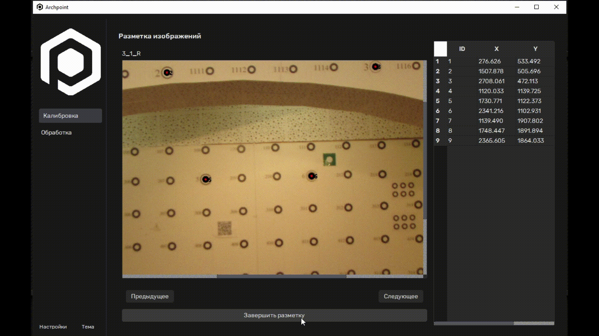

<p align="center">
  
</p>

<h1 align="center">Archpoint</h1>

<p align="center">
  Desktop-приложение для получения плотного облака точек архитектурных объектов  
  с поддержкой автоматической и ручной калибровки камер в моно и стерео режимах.
</p>

<p align="center">
  
  
  
</p>

<p align="center">
  <a href="https://github.com/cloudsucker/archpoint/commits/main/">
    
  </a>
  <a href="https://github.com/cloudsucker/archpoint/issues">
    
  </a>
  <a href="https://github.com/users/cloudsucker/projects/3">
    
  </a>
  <a href="LICENSE.md">
    
  </a>
</p>

<p align="center">
  
</p>

> ![!WARNING]
> Данный репозиторий на данный момент находится в активной разработке. Некоторые детали могут быть описаны или реализованы неполностью или неккоректно. Буду рад вашей помощи в их обнаружении!

## 🚀 Установка

### 📦 Обычная установка

> [!NOTE]
> Скоро всё напишем! 😊

### 🛠 Установка в режиме разработки

#### **1. Создайте виртуальное окружение:**

```bash
python -m venv .venv
```

#### **2. Активируйте виртуальное окружение:**

```bash
.venv/Scripts/activate
```

#### 3. **Клонируйте репозиторий:**

```bash
git clone https://github.com/cloudsucker/archpoint.git
```

#### 4. **Установите зависимости:**

**Перейдите в директорию проекта:**

Для перехода в созданную при клонировании репозитория директорию используйте:

```bash
cd archpoint/
```

**Запустите установку зависимостей:**

```bash
pip install -r requirements.txt
```

> [!IMPORTANT]  
> Установка требует подключения к интернету для загрузки библиотеки [HLOC](https://github.com/cvg/Hierarchical-Localization) из GitHub-репозитория для последующей её установки в качестве зависимости. Этот процесс может занять некоторое время.

### 🚀 Запуск

Запустите файл `main.py` из корня проекта.

## 🔗 **Зависимости**

-   numpy<2.0.0
-   opencv-python==4.11.0.86
-   PySide6==6.8.2.1
-   git+https://github.com/cvg/Hierarchical-Localization.git#egg=hloc

> [!WARNING]  
> Проект требует версии `numpy<2.0.0` для корректной работы.

## ⚙️ **Калибровка**

Демонстрация ручного метода калибровки с расстановкой точек:


## 📬 **Обратная связь**

**Репозиторий активно развивается, буду рад обратной связи.**

**По всем вопросам:** ferjenkill@gmail.com
